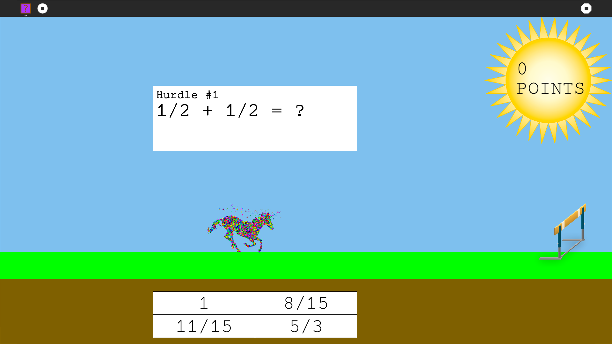

Math Hurdler
============

A game designed to help teach children math in accordance with the Common Core standard for fourth grade students. 

This file was generated by [sugar-quickstart](https://github.com/liam-middlebrook/sugar-quickstart)

